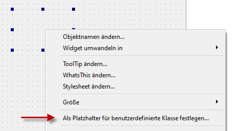
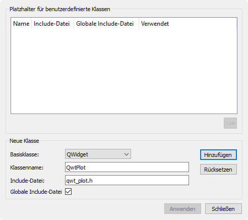
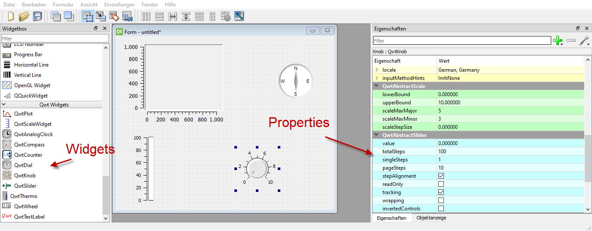

# Verwendung der Bibliothek in eigenen Programmen

Wie bei anderen externen Bibliotheken, gibt es grundsätzlich zwei Möglichkeiten, die Qwt-Bibliothek in eigenen Projekten zu verwenden:

1. Verwendung einer installierten, kompilierten Bibliothek unter Verwendung der installierten Headerdateien und Bibliotheken
2. Verwendung der Qwt-Bibliothek im Quelltext innerhalb der eigenen Projektstruktur

Unter Linux-Systemen (bzw. unter MacOSX, wenn Qwt über Homebrew oder MacPorts installiert ist), wird zumeist die Variante 1 sinnvoll sein.

Variante 2 ist stets dann sinnvoll, wenn man Zugriff auf die Implementierung der Qwt-Bibliothek haben möchte und gegebenenfalls eigene Änderungen einbringen möchte, oder wenn man mit einer noch nicht veröffentlichten Version aus einem Quelltextarchiv arbeiten will.

Auch für die Verwendung von Visual Studio unter Windows ist die Variante 2 am sinnvollsten, da so flexibel zwischen Debug und Release-Builds umgeschaltet werden kann (siehe [Visual Studio Projekte](#erstellen-mit-visual-studio)).

## Installation von vorkompilierten Bibliotheken aus Linux-Paketrepositories

Bei populären Linux-Distributionen gibt es Pakete für die Qwt-Bibliothek. Bei Ubuntu sind das beispielsweise:

**Ubuntu 16.04 LTS**:

```bash
# Qwt 5.x unter Verwendung von qt4 (für Qwt 5.2.3-1)
> sudo apt install libqwt5-qt4-dev

# Qwt 6.x unter Verwendung von qt5 (für Qwt 6.1.2-5)
> sudo apt install libqwt-qt5-dev
```

**Ubuntu 18.04 LTS**:

```bash
# Qwt 5.x unter Verwendung von qt4 (für Qwt 5.2.3-1)
> sudo apt install libqwt5-qt4-dev

# Qwt 6.x unter Verwendung von qt4 (für Qwt 6.1.3-1)
> sudo apt install libqwt-dev

# Qwt 6.x unter Verwendung von qt5 (für Qwt 6.1.3-1)
> sudo apt install libqwt-qt5-dev
```

Bei anderen Linux-Distributionen ist das ähnlich. Eventuell kann man bei der Gelegenheit auch noch die Qt-Designer-Plugins mit installieren (siehe [Plugin-Installation in Linux/Mac - Aus Paketquellen](#qt-designer-plugins-fur-qwt-komponenten).

## Installation mittels HomeBrew auf dem Mac

Für neuere Mac-Versionen (sierra bis mojave) kann man [HomeBrew](https://brew.sh/index_de) verwenden:

```
brew install qwt
```

Für ältere Versionen kann man Qwt aus dem Quelltextarchiv installieren (siehe unten).

## Installation vom Quelltextarchiv (alle Plattformen)

Die jeweils aktuellste Qwt-Bibliothek kann vom SourceForge-Repository heruntergeladen werden: [Qwt SourceForge Projektseite](https://sourceforge.net/projects/qwt).

Entweder man entpackt die zip-Datei eines Releases, oder man checkt the Quelltext des subversion-Repositories aus. Das Quelltextarchiv (aktueller Stand im Repository) enthält folgende Verzeichnisstruktur:

```bash
admin         # Deployment-Scripte, nur im Repository
classincludes # Include-Dateien im Still von Qt5 Includes (ab Qwt 6.2)
designer/     # Quelltext der Designer-Plugins
doc/          # Doxygen Konfigurationsdateien
examples/     # Beispiele
playground/   # Zusätzliche Tests/Beispiele, ab Qwt 6.2
src/          # Der eigentliche Quelltext
tests/        # spez. Komponententests, ab Qwt 6.2
textengines/  # Zusatzkomponenten für Texte (MathML), ab Qwt 6.3

qwtbuild.pri      # Grundlegende Kompilierungseinstellungen
qwtconfig.pri     # Auswahl der zu kompilierenden Teile
qwt.pro           # Haupt QMake-pro-Datei
```

Im Verzeichnis gibt es die Datei `qwtconfig.pri`, welche gut dokumentiert ist und einige Anpassungen an den zu verwendenden/zu erstellenden Qwt-Komponenten erlaubt. Beispielsweise können durch Einschalten der Zeile die Beispiele erstellt werden.

```bash
QWT_CONFIG     += QwtExamples
```

Nach der Anpassung der Konfigurationsdatei wird die Bibliothek erstellt.

### Erstellen und Installation der Bibliothek unter Linux/Mac

----
**MacOSX Anpassung**:

In der Datei `designer/designer.pro` den Text:

		target.path = $${QWT_INSTALL_PLUGINS}
		INSTALLS += target
	}
	else {
		TEMPLATE        = subdirs # do nothing
	}

mit

		target.path = $${QWT_INSTALL_PLUGINS}
		INSTALLS += target

		macx {
			contains(QWT_CONFIG, QwtFramework) {
				QWT_LIB = qwt.framework/Versions/$${QWT_VER_MAJ}/qwt
			}
			else {
				QWT_LIB = libqwt.$${QWT_VER_MAJ}.dylib
			}
			QMAKE_POST_LINK = install_name_tool -change $${QWT_LIB} $${QWT_INSTALL_LIBS}/$${QWT_LIB} $(DESTDIR)$(TARGET)
		}
	}
	else {
		TEMPLATE        = subdirs # do nothing

ersetzen.

**MacOSX Anpassung Ende**

----

Im Wurzelverzeichnis werden auf der Kommandozeile folgende Befehler ausgeführt:

```bash
> qmake
> make    # oder make -j4
> sudo make install
```

Standardmäßig wird Qwt in folgende Verzeichnisse installiert (weswegen sudo benötigt wird):

    /usr/local/qwt-<version>

also z.B.:

    Include-Dateien in : /usr/local/qwt-6.1.4/include
    Bibliothek in      : /usr/local/qwt-6.1.4/lib
    Dokumentation in   : /usr/local/qwt-6.1.4/doc

### Erstellen und Installation der Bibliothek unter Windows

Je nach verfügbarem Compiler ist das Prozedere etwas anders, aber meist sehr ähnlich. Ist der Qt Creator samt Compiler bereits eingerichtet, kann man die `qwt.pro`-Datei einfach als Projekt in Qt Creator öffnen und im Debug/Release-Modus erstellen. Man kann dann in den Projekteinstellungen einen _Deployment_-Schritt konfigurieren, und darüber dann die Bibliothek installieren.

Alternativ braucht man eine Kommandozeile mit entsprechend gesetzten Umgebungsvariablen zum Übersetzen von C++-Programmen (Beispielsweise bei Visual Studio die `vcvarsall.bat` aufrufen). Auch die Pfade zur Qt-Installation müssen gesetzt sein, sodass `qmake` im Pfad ist.

**Beispiel:**

```batch
:: Entwicklungsumgebung für VC (x64) einrichten
C:\Downloads\qwt-6.1.4>"c:\Program Files (x86)\Microsoft Visual Studio 14.0\VC\vcvarsall.bat" x64

:: Pfad zu Qt setzen
C:\Downloads\qwt-6.1.4>set PATH=%PATH%;C:\Qt\5.11.3\msvc2015_64\bin

:: qmake ausführen
C:\Downloads\qwt-6.1.4>qmake
Info: creating stash file C:\Downloads\qwt-6.1.4\.qmake.stash

:: erstellen
C:\Downloads\qwt-6.1.4>nmake

:: installieren
C:\Downloads\qwt-6.1.4>nmake install
```

Standardmäßig wird Qwt in folgende Verzeichnisse installiert:

    C:\Qwt-<version>

also z.B.:

    Include-Dateien in : C:\Qwt-6.1.4\include
    Bibliothek in      : C:\Qwt-6.1.4\lib
    Dokumentation in   : C:\Qwt-6.1.4\doc

> Mächte man "am Ball" bleiben und Qwt gelegentlich aktualisieren, so kann man das Verzeichnis nach `C:\Qwt-6.1` umbenennen, und so die Konfiguration abhängiger Projekte längere Zeit unverändert lassen, auch wenn man zwischenzeitlich eine neue Qwt-Version installiert.

# Verwenden der installierten Bibliothek

## Typische Installationspfade bei vorkompilierten Bibliotheken aus dem Paketmanager

Die Installationspfade sind von der jeweiligen Linux-Distribution abhängig, üblicherweise liegen die Bibliotheken und Include-Pfade jedoch in den systemweiten Standardsuchverzeichnissen. Das macht die Verwendung einfach.

Bei manuell installierten Bibliotheken aus dem Quelltextarchiv, können die Pfade beliebig über den Install-Prefix angepasst werden - oder man verwendet die oben aufgeführten Standardpfade.

## Konfiguration von Projektdateien

Unabhängig vom Buildsystem (qmake, cmake, Visual Studio, ...) muss der Pfad zur Datei `qwt.h` im Suchpfad stehen. Ebenso muss der Linker die `libqwt-xxx.so`-Datei finden (bzw. bei statisch erstellter Qwt-Bibliothek die Datei `libqwt.a`).

### Beispielkonfiguration - Windows - Qmake

```
INCLUDEPATH += C:\Qwt-6.1.4\include

LIBS += -LC:\Qwt-6.1.4\lib -lqwt
```

Im Debug-Modus kann auch `-lqwtd` verwendet werden.

### Beispielkonfiguration - Linux/Mac - Qmake - bei Installation aus Quelltextarchiv

```
INCLUDEPATH += /usr/local/qwt-6.1.4/include

LIBS += -L/usr/local/qwt-6.1.4/lib -lqwt
```

### Beispielkonfiguration - Linux/Mac - Qmake - bei Installation aus Paketquelle

```
INCLUDEPATH += /usr/include/qwt

LIBS += -L/usr/lib -lqwt-qt5
```

Der tatsächliche Bibliotheksname hängt von dem jeweiligen Paket der Linux-Distribution ab. Notfalls mal im Verzeichnis `/usr/lib` nachschauen, was da an `libqwt....`-Dateien existiert.

## Suchpfade für Laufzeitbibliotheken

Unter Windows muss man entweder den Pfad zur Qwt-DLL in die PATH-Variable eintragen, oder man kopiert einfach die DLL in das Verzeichnis der eigenen exe-Datei (das ist zumeist der einfachste Weg - hierbei je nach Debug/Release-Modus die passende `qwtd.dll` und `qwt.dll` linken und kopieren).

Unter Linux kann man den LD_LIBRARY_PATH anpassen oder mittels RPATH den Laufzeitpfad in die Anwendung hineinkompilieren. Mehr dazu in der Qwt-Dokumentation unter `doc/html/qwtinstall.html`.

Auch praktikabel ist unter beiden Plattformen die Erstellung und Verwendung von Qwt als statischer Bibliothek. Dies kann in der `qwtconfig.pri` eingestellt werden (Zeile `QWT_CONFIG           += QwtDll` auskommentieren!).

# Verwendung von Qwt-Komponenten im Qt Creator/Designer

## Verwendung der Platzhaltertechnik
Die einfachste Variante, Qt Komponenten im Qt Designer zu verwenden, ist die Platzhaltertechnik. Dabei wird einfach ein Widget eingefügt (man sollte eine Mindestgröße definieren!) und dann über Rechtsklick die Option _"Als Platzhalter für benutzerdefinierte Klasse festlegen..."_ auswählen.



Im Dialog definiert man Klassenname (beispielsweise QwtPlot), den Include-Dateinamen (`qwt_plot.h`) und checkt die Option "Globale Include-Datei".



Nach Bestätigen des Dialogs kann man die Klasse auswählen und auf "Anwenden" klicken. In der Widgethierarchie in der Eigenschaftsleiste sollte nun als Klassentyp "QwtPlot" beim ausgewählten Widget erscheinen, auch wenn weiterhin nur ein nacktes Widget im Formular/Dialog angezeigt wird. Ebenso können nur die Eigenschaften der vererbten QWidget-Klasse im Designer definiert werden. Die anderen Eigenschaften müssen klassisch im Quelltext der verwendenden Klasse angepasst werden.

Möchte man etwas bequemer einzelne (ausgewählte) Klasseneigenschaften von Qwt-Widgets anpassen, so kann man das Qt Designer/Creator-Plugin verwenden:

## Qt Designer Plugins für Qwt Komponenten

Das Qwt Designer Plugin wird bei manchen Paketverwaltungen (siehe oben Linux/Mac) bereits vorkompiliert installiert. Falls man Qwt vom Quelltext aus kompiliert und installiert, muss man die Plugin-Bibliothek noch in das entsprechende Verzeichnis kopieren.

### Plugin-Installation in Windows

Falls wie im Beispiel oben Qwt nach `C:\Qwt-6.1.4` installiert wurde, so befindet sich die dll in:

    c:\Qwt-6.1.4\plugins\designer\qwt_designer_plugin.dll

Diese Datei wird nun einfach in das Plugin-Verzeichnis des Qt Designers kopiert, also beispielsweise:

    c:\Qt\5.11.3\msvc2015_64\plugins\designer\qwt_designer_plugin.dll

Öffnet man nun Qt Designer (_!!wirklich den Designer, nicht Qt Creator!!_), so sieht man nun eine neue Widget-Palette (links unten) und bei Auswahl eines Qwt-Objekts auch die dazugehörigen Eigenschaften in der Eigenschaftspalette:



### Plugin-Installation in Linux/Mac - Aus Paketquellen

Unter Ubuntu gibt es eine Paketquelle, welche die qwt-Plugins mit installiert.

```bash
> sudo apt install qtcreator-plugin-ubuntu
```
Zusammen mit dem bereitgestellten vorkompilierten Qwt-Bibliotheken kann man also direkt loslegen.

### Plugin-Installation in Linux/Mac - bei selbstkompiliertem Qwt

Die Plugin-Installation funktioniert und Linux/Mac ähnlich, d.h. erst das Plugin compilieren, und dann die Datei `libqwt_designer_plugin.so` in das Unter-Verzeichnis `gcc_64/plugins/designer` der Qt-Installation kopieren.

**Beispiel:**

```bash
# Pfad zu qwt
/home/markus/qwt-6.1.4
# erstelltes Plugin
/home/markus/qwt-6.1.4/designer/plugins/designer/libqwt_designer_plugin.so
# Zielpfad der so-Datei im Installationspfad Qt (aus manueller Installation)
/home/markus/Qt5.13.0/5.13.0/gcc_64/plugins/designer/libqwt_designer_plugin.so
```

Bei einer systemweiten Qt-Installation ist das Zielverzeichnis (unter Ubuntu):
```bash
# Zielpfad für designer-plugin bei Qt Installation aus Paketquellen
/usr/lib/x86_64-linux-gnu/qt5/plugins/designer/
```

> Anmerkung: Falls man Qt aus den Paketquellen installiert hat, kann es sein, dass beim Erstellen der Qwt-Bibliothek die Plugins nicht kompiliert werden, obwohl das in der qwt-Config-Datei eingeschaltet ist. Wenn man `qmake` direkt im `designer`-Unterverzeichnis ausführt, erhält man die Fehlermeldung: _Project WARNING: QwtDesigner is enabled in qwtconfig.pri, but Qt has not been built with designer support_. In diesem Fall funktioniert es aber, den Qt Designer nebst Plugins für die ui-Erstellung/Konfiguration zu nehmen, und in den qmake-Projekten einfach die Include/Lib-Pfade zur selbsterstellten Qwt-Bibliothek zu verwenden.

## Qt Creator Plugins

TODO ... (siehe src-Paket https://packages.ubuntu.com/source/xenial/qtcreator-plugin-ubuntu)

# Erstellen mit Visual Studio

... TODO ... Qt Addin -> qwt.pro importieren ...
